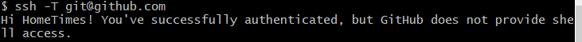

# Git

## git的工作流程图


## 命令模式

### 开始

##### 第一步


##### 向仓库添加文件

##### 删除仓库文件


##### 查看git的配置文件

git config --list

##### 克隆

git clone  仓库地址

### 暂存区

##### 查看暂存区的文件

git ls-files 

##### 移除暂存区的文件

git rm --cached +文件名

##### add

git add  空文件夹：结果添加不了

## git仓库

### 分支

##### 创建分支

git branch  分支名

##### 删除本地分支

```
git branch -d branch_name
```

##### 删除远程分支  

git push origin --delete 分支名称

##### 删除远程分支

```
git branch -r -d origin/branch-name  
git push origin :branch-name 
```

##### 查看分支

git branch

##### 切换分支

git checkout  分支名

注意：切换分支时，工作区的文件会变为当前分支时所拥有的文件

##### 创建一个叫做“feature_x”的分支，并切换过去

git checkout -b feature_x

##### 再把新建的分支删掉

git branch -d feature_x

##### 合并分支

如果是多人开发的话 需要把远程master上的代码pull下来

```
git pull origin master
```

合并前要先切回要并入的分支
以下表示要把issue1234分支合并入master分支

```javascript
$: git checkout master
$: git merge issue1234
```

##### 查看远程分支

git branch -r

##### 查看所有分支

git branch -a 

##### 创建远程分支

如果远程新建了一个分支，本地没有该分支。

可以利用git checkout --track origin/branch_name ，

这时本地会新建一个分支名叫 branch_name ，

会自动跟踪远程的同名分支 branch_name。

```
git checkout --track origin/branch_name
```

##### 提交本地分支

如果本地新建了一个分支 branch_name，但是在远程没有。

这时候 push 和 pull 指令就无法确定该跟踪谁，一般来说我们都会使其跟踪远程同名分支，所以可以利用 git push --set-upstream origin branch_name ，这样就可以自动在远程创建一个 branch_name 分支，然后本地分支会 track 该分支。后面再对该分支使用 push 和 pull 就自动同步。

```
git push --set-upstream origin branch_name
```

##### 你将分支推送到远端仓库

git push origin <branch>

### 推送本地分支到远程不同名分支

##### 1.设置test为跟踪origin/dev分支

切换到test分支

```
git branch -u origin/dev
```

##### 2.查看跟踪版本

即：你切换的所有的分支记录

```
git branch -vv
```

3.提交代码试试

```
git add .
git commit -m '测试'
git push origin head:dev
```

##### 4.每次都要写 head:dev 觉得很累赘，修改一下配置

```
git config --global push.default upstream
```

之后可以直接这样提交

```
git push
```

### 撤销未提交的修改

假如我们提交了一个Git版本，但是在工作区的某个文件被我们修改了并且已保存了，然后退出了工作区的某个文件，然后发现写的一团糟，却又怎么也撤不回原来的内容了

解决：

对比git仓库（commit）已提交的内容和工作区的内容

##### git diff


图中红色为原来提交（原来）的内容，绿色为新增的内容

恢复原来的内容

##### git checkout  

工作区要恢复的文件


### 版本回退

在Git中，用HEAD代表当前版本，上一个版本就是HEAD^，再上一个版本就是HEAD^^依次类推！我们先Git Log看下版本历史先

我们回到前一个提交的版本吧，依次键入下述指令：

```
 git reset --hard HEAD
 git reset --hard HEAD^ 或者 当然你可以直接这样写：git reset --hard ad2080c
```

Git Log看下版本历史先

### 版本回退的后悔药

回退后，你突然后悔了，想回退回新的那个版本，可是遗憾的是，你键入git log却发现没有了最新的那个版本号，这怎么办呢... 没事，Git中给你提供了这颗"后悔药"，Git记录着你输入的每一条指令呢！键入：

```
git reflog：看版本回退得记录
```

回到某个版本

git reset --hard ad2080c

### readme

新建的readme.txt文件，一定要在pro目录，不然git无法管理这里文件哦

## 远程仓库gitHub


##### 提交到远程仓库

1. git branch -M 分支名


2.git remote add origin <server>


执行以上命令会在本地仓库的config文件中会自动加上：


3.推送代码到远程仓库

git push -u origin main


拉取pull=fetch+merge

git pull --rebase origin master

##### 问题

1



解决

###### ssh密钥

步奏：

1.生成新的ssh密钥

执行命令： ssh-keygen -t rsa -C "你的邮箱"

会生成以下文件


2.将您的 SSH 私钥添加到 ssh-agent


然后还会生成一个host文件

验证：

验证您是否已生成私钥并将其加载到 SSH 中，可以对比github中的公钥（记得要添加公钥到github中）


------------
